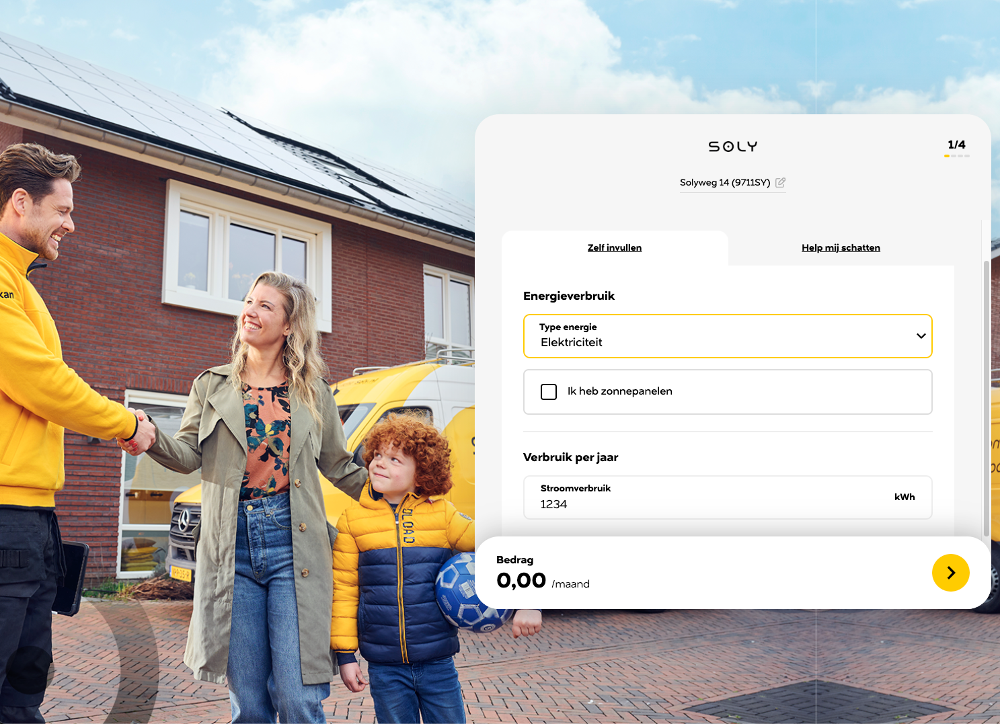

# Frontend assessment

## Requirements

Complete the already created form in the `app.component.html` and add the following features:

- The app should be accessible from the following url: `/configurator`
- The user should be able to choose between his/her energy type. Possible options are:
  - Electricity
  - Electricity and gas
- There should be a checkbox input, that toggles the field 'Yield per year'
- When the user chooses the option 'Electricity', the 'Electricity usage' field should be shown and be required
- When the user chooses the option 'Electricity and gas', both the 'Electricity usage' field and 'Gas usage' field should be shown and be required
- If the user has solar panels, the yearly yield field should be shown and be required
- Make a footer where the data (received from the (mock) backend) is shown
  - The price you receive from the backend should be formatted to Euro's
- Add styling to the application. You can choose to add your own styling or use our Energy Configurator as an example. (see screenshot below)
- Add input validation styling when required inputs are not entered by the user

The `POST` request to the (mock) backend has a few required values and some optional, based on the input of the user. The request url is `http://localhost:3000/api/calculate`. It will return an object with the montly price in euros, nested inside a data object.

```javascript
  contractType: 'ENERGY' | 'BOTH'; // always required
  hasSolarPanels: boolean; // always required
  energyUsage: number; // always required
  gasUsage?: number; // optional, required when user chooses contractType: 'BOTH'
  yearlyYield?: number; // options, required when user chooses hasSolarPanels: true
```



## Technical requirements

- Use the Angular Reactive Forms to create the forms that are located in the template
- Split up the HTML in (bite sized) components, for better readability

## Conditions

- To get a general idea of the level of Angular knowledge you have, we would recommend you to spend around 3 to 4 hours on this assessment. If it is a bit more, that's no problem. If you're done in less, maybe you can add some extra styling, tests or other things to show your skills.
- You can fork this Github repository to your own Github account. Pay attention to your commit's and commit messages. Don't make them too large and refer in the commit message to what you have created, changed or deleted.

## Tips

Here are some tips to look out for when you're working on this assessment:

- Try to make sure you don't repeat yourself with coding (DRY method)
- Make good use of Typescript, so the code gets more readable for other developers
- If you've got some time left still and have some prior knowledge with RxJS, Testing or something else, definitely show it in the assessment!

## Project

This project uses the Nx Monorepo structure, for an easy and accessible coding experience.

## Setup

Run a quick `npm install` in the root of the project to install all the dependencies.

## Start the application

Run `npx nx run-many --target=serve --all=true` to start the development server of the frontend application and the 'mock' backend. This way you can start off directly.

The frontend application is available on `http://localhost:4200` and the backend server is available on `http://localhost:3000/api`.

Run `npx nx serve frontend` or `npx nx serve server`, if for some reason you only want to run the frontend or backend.
